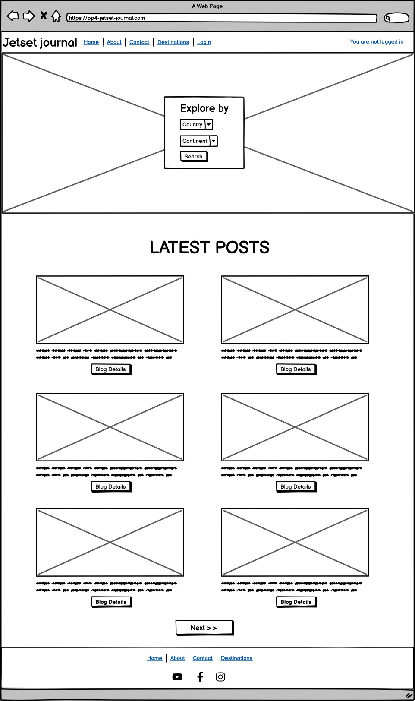
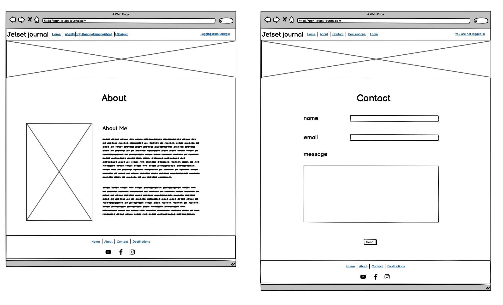

# PP4 Jetset Journal

## Developer: Róisín O'Connell 


[View the live project here](https://pp4-jetset-journal-4cbea9e2528c.herokuapp.com/)

[View GitHub repository](https://github.com/roc-11/pp4-jetset-journal)

## Introduction

Jetset Journal is a website tailored for individuals passionate about travel and seeking new adventures. Serving as a comprehensive travel blog, the platform enables administrators to curate and publish engaging blog posts accessible to users on the front end.

Visitors to the website have the opportunity to explore each blog post, accessing detailed information and captivating images of various destinations. Additionally, users can initiate contact with Jetset Journal through an integrated contact form, facilitating seamless communication.

Registering and logging in to the website grants users the ability to interact further by leaving comments or expressing appreciation for blog posts. Furthermore, registered users have the option to edit or delete their comments as desired.

To maintain the integrity of the platform, all comments undergo verification and approval by an administrator prior to publication on the website. This ensures that only authenticated and relevant contributions are displayed to the audience.

## UX

### Planning Stage

#### Aim

The aim of Jetset Journal is to inspire travel enthusiasts by providing a platform for exploring, sharing, and celebrating global adventures. Through engaging blog content, our website aims to ignite wanderlust, encourage cultural exchange, and foster a community of like-minded adventurers. From discovering hidden gems to connecting with fellow travelers, Jetset Journal is the go-to destination for planning unforgettable journeys and creating lifelong memories.

#### Application Goals

Goals for New Users
* As a new site user, I would like to view an intuitive website with straightforward navigation that is fully responsive.
* As a new site user, I would like to create an account so that I can comment on and like blog posts. 
* As a new site user, I would like to easily edit and delete any comments that I make.
* As a new site user, I would like to easily contact the website administrators with questions.
* As a new site user, I would like to easily understand the main purpose of the site.
* As a new user, I want attractive and relevant visuals and colour schemes that work with the content.

Goals for Returning Users
* As a returning site user, I would like to view an intuitive website with straightforward navigation that is fully responsive.
* As a returning site user, I would like to easily log into my account so that I can comment on and like blog posts. 
* As a returning site user, I would like to easily edit and delete any comments that I make.

Goals for Site Administrators
* As a site administrator, I would like to have a recognizable branded admininstator area to manage users, blog posts, blogs comments and blog likes.
* As a site administrator, I would like to easily create blog postings in draft or published form, for display on Jetset Journal.
* As a site administrator, I would like to easily edit the about text and profile picture using a user-friendly UI.
* As a site administrator, I would like to have control over approving user comments before they appear on the front-end.
* As a site administrator, I would like to manage user contact requests and mark them as read.
* As a site administrator, I would like to have a simple UI that will encourage users to return and engage with the blog.

#### User Stories

All epics, user stories with their acceptance criteria and tasks can be viewed on the [Github Project Board](https://github.com/users/roc-11/projects/4).

- There were 15 Epics created from Project Concept to Project Submission.

- There were 23 User Stories Created including:
    1. USERSTORY # 1: Gather General Requirements & Visual Layout
        - As a Developer I can see how the site should be laid out and make a detailed plan so that the site functionality can be developed in an incremental manner.
    2. USERSTORY #2: Initial Django project setup
        - As a developer I can set up the initial project files in the developer environment and deploy to Heroku so that I have a base for my project and can resolve any deployment issues early on.
    3. USERSTORY # 3: Create Front-End Site, using Bootstrap Template
        - As a Developer I can design and deploy a basic website so that it meets the minimum viable requirements.
    4. USERSTORY #4: Create Post Model for Blog
        - As a site admin I can create, read, update and delete blog posts in the admin section so that I can manage my blog content.
    5. USERSTORY #5: Display Post detail
        - As a Site User I can click on a post so that I can read the full text.
    6. USERSTORY #6: Create SuperUser Account
        - As a Site Admin I can login into the Admin area so that I can manage website content.
    7. USERSTORY #7: Customise admin area
        - As a Site Admin I can recognise the admin area has the same look & feel as the front-end site so that website continuity is maintained.
    8. USERSTORY #8: User Registration
        - As a Site User I can login, logout and register so that I can view my user profile and comment on blog posts.
    9. USERSTORY #9: Create Comment Model
        - As a Site Admin I can create Comments table/model so that I can manage comments.
    10. USERSTORY #10: View Comments and Comment on a post
        - As a Site User/Admin I can view comments on an individual post so that I can read the conversation.
    11. USERSTORY #11: Modify or delete Comment on a Post
        - As a Site User I can modify or delete my comment on a post so that I can be involved in the conversation.
    12. USERSTORY #12: Approve comments
        - As a Site Admin I can approve or disapprove comments so that I can filter out objectionable comments.
    13. USERSTORY #13: Create Destination Model
        - As a Site Admin I can create Destination table/model so that I can manage destinations and enable filtering by Destination on the front-end.
    14. USERSTORY #14: Search for blog posts by destination
        - As a Site I can search for blog posts based on destination so that I can display a list of posts based on a particular country or continent I am interested in.
    15. USERSTORY #15: Request for contact
        - As a Potential Collaborator I can fill in a contact form so that I can submit a request for contact.
    16. USERSTORY #16: Review contact requests
        - As a Site Admin I can store contact/collaboration requests in the database so that I can review them.
    17. USERSTORY #17: Manage contact requests
        - As a Site Admin I can mark contact/collaboration requests as "read" so that I can see how many I still need to process.
    18. USERSTORY #18: Read about the site
        - As a Site User I can click on the About link so that I can read about the site.
    19. USERSTORY #19: Add and update the about text
        - As a Site Admin I can create or update the about page content so that it is available on the site.
    20. USERSTORY #20: Create Like Model
        - As a Site Admin I can create Like table/model so that I can manage likes.
    21. USERSTORY #21: View Likes and Like/Unlike a post
        - As a Site User/Admin I can view likes on an individual post so that I can be an active member of Jetset Journal/react to a blog post.
    22. USERSTORY #22: Create User Profile/Dashboard Page
        - As a Logged in User I can view my user profile so that manage my profile and update my user details.
    23. USERSTORY #23: Edit User Profile/Dashboard Page
        - As a Logged in User I can edit my user profile so that manage my profile and update my user details.

### Wireframes

The appearance of each page of the website was planned by making wireframes. It was essential to provide a positive user experience for the user. 

Initially, wireframes plans were hand-drawn on a notepad. More detailed wireframes were then created using a desktop version of [Balsamiq](https://balsamiq.com/ "Link to Balsamiq homepage"). Note: due to time constraints and illness, the Destinations page and functionality was moved to future development.

They can be found below:






### Flow Chart

To follow best practice, a flowchart was created for the website's logic, and mapped out before coding began using a free version of [Lucidchart](https://www.lucidchart.com/pages/ER-diagram-symbols-and-meaning).

Below is the flowchart of the main process of this website:


### Colour Scheme

The colour scheme was inspired by the theme 'Fun and professional' by [Mark Dearman](https://www.markdearman.com/). This scheme can be found on [Canva](https://www.canva.com/learn/website-color-schemes/).

The scheme was chosen because it is both clean and professional, yet the pops of colour bring an element of fun and excitement. These are the emotions which Jetset Journal aims to evoke in users. 

Details of the full colour palette can be found below:


### Typography

The pairing chosen for the site are: 
* [Chivo](https://fonts.google.com/specimen/Chivo?preview.text=Max%20Rehab%20Physiotherapy&preview.text_type=custom)
* [Krub](https://fonts.google.com/specimen/Krub)
* [Roboto](https://fonts.google.com/specimen/Roboto)
* [Lato](https://fonts.google.com/specimen/Lato)
* A backup of 'Lato' and sans-serif are applied in case of failure.

Chivo is used for title headings, while Krub is used for almost all other text. Both were imported from[Google Fonts](https://fonts.google.com/).

## Features

### Existing Features

### Future Features

## Tools & Technologies Used

## Database Design

Entity Relationship Diagrams (ERD) help to visualize database architecture before creating models. Understanding the relationships between different tables can save time later in the project.

To follow best practice, a database schema was created for the backend DB and tables, and mapped out before coding began using a free version of [Lucidchart](https://www.lucidchart.com/pages/ER-diagram-symbols-and-meaning).

Below is the database structure:


Below are the Models used for the project, used to create an ERD with the relationships identified in the schema:

```python
class Post(models.Model):
    title = models.CharField(max_length=200, unique=True)
    slug = models.SlugField(max_length=200, unique=True)
    author = models.ForeignKey(
        User, on_delete=models.CASCADE, related_name="blog_posts")
    featured_image = CloudinaryField('image', default='placeholder')
    content = models.TextField()
    created_on = models.DateTimeField(auto_now_add=True)
    status = models.IntegerField(choices=STATUS, default=0)
    excerpt = models.TextField(blank=True)
    updated_on = models.DateTimeField(auto_now=True)
    destination = models.CharField(
        choices=DESTINATIONS, default='europe', max_length=50)
    likes = models.ManyToManyField(
        User, related_name='blogpost_like', blank=True)

    class Meta:
        ordering = ["-created_on"]

    def __str__(self):
        return f"{self.title} | written by {self.author}"
    
    def number_of_likes(self):
        return self.likes.count()


class Comment(models.Model):
    post = models.ForeignKey(
        Post, on_delete=models.CASCADE, related_name="comments")
    author = models.ForeignKey(
        User, on_delete=models.CASCADE, related_name="commenter")
    body = models.TextField()
    approved = models.BooleanField(default=False)
    created_on = models.DateTimeField(auto_now_add=True)

    class Meta:
        ordering = ["-created_on"]

    def __str__(self):
        return f"Comment {self.body} by {self.author}"


class Like(models.Model):
    user = models.ForeignKey(
        User, on_delete=models.CASCADE)
    post = models.ForeignKey(
        Post, on_delete=models.CASCADE)
    value = models.CharField(choices=LIKE_CHOICES, default='Like', max_length=10)

    def __str__(self):
        return str(self.post)
```

## Agile Development Process

[GitHub Projects](https://github.com/roc-11/pp4-jetset-journal/projects) served as an Agile tool for this project.

The Jetset Journal project was managed from the beginning using [GitHub Projects (View Project Here)](https://github.com/users/roc-11/projects/4/views/1?layout=board), in order to ensure an agile approach.
  - The project goals were broken into Epics, each further divided into User Stories. 
  - Each User Story contains acceptance criteria and individual tasks.
  - Each individual User Story was assigned a specific number of story points determined by a rough estimate of the time required to complete the task.
  - This allowed me to create a roadmap with milestones. [View Roadmap Here](https://github.com/users/roc-11/projects/4/views/1)
  - Each User Story was also assigned a label (according to the MoSCoW System) so I could prioritise the work.


### Github Projects

The Jetset Journal project was managed from the beginning using [GitHub Projects (View Project Here)](https://github.com/users/roc-11/projects/4/views/1?layout=board), in order to ensure an agile approach. Please refer above to [Agile Development Process](#agile-development-process) for more details. 

### Github Issues

[GitHub Issues](https://github.com/roc-11/pp4-jetset-journal/issues) served as an another Agile tool. There, I used my own **User Story Template** to manage user stories.

It also helped with milestone iterations on a weekly basis.

GitHub Issues were used to create Epics and User Stories for the project. Each issue was added to the Jetset Journal Project and assigned relevant lables. Please refer above to [Agile Development Process](#agile-development-process) for more details. 


### MoSCoW Prioritisation

I've decomposed my Epics into stories prior to prioritizing and implementing them.
Using this approach, I was able to apply the MoSCow prioritization and labels to my user stories within the Issues tab.

- **Must Have**: guaranteed to be delivered 
- **Should Have**: adds significant value, but not vital 
- **Could Have**: has small impact if left out 
- **Won't Have**: not a priority for this iteration (future development)

Each User Story was also assigned a label (according to the MoSCoW System) so I could prioritise the work. Please refer above to [Agile Development Process](#agile-development-process) for more details. 

## Testing

For all testing, please refer to the [TESTING.md](TESTING.md) file.

## Deployment

The live deployed application can be found deployed on [Heroku](https://pp4-jetset-journal-4cbea9e2528c.herokuapp.com/).

### ElephantSQL Database

This project uses [ElephantSQL](https://www.elephantsql.com) for the PostgreSQL Database.

To obtain your own Postgres Database, sign-up with your GitHub account, then follow these steps:

- Click **Create New Instance** to start a new database.
- Provide a name (this is commonly the name of the project: pp4-jetset-journal).
- Select the **Tiny Turtle (Free)** plan.
- You can leave the **Tags** blank.
- Select the **Region** and **Data Center** closest to you.
- Once created, click on the new database name, where you can view the database URL and Password.

### Cloudinary API

This project uses the [Cloudinary API](https://cloudinary.com) to store media assets online, due to the fact that Heroku doesn't persist this type of data.

To obtain your own Cloudinary API key, create an account and log in.

- For *Primary interest*, you can choose *Programmable Media for image and video API*.
- Optional: *edit your assigned cloud name to something more memorable*.
- On your Cloudinary Dashboard, you can copy your **API Environment Variable**.
- Be sure to remove the `CLOUDINARY_URL=` as part of the API **value**; this is the **key**.

### Heroku Deployment

This project uses [Heroku](https://www.heroku.com), a platform as a service (PaaS) that enables developers to build, run, and operate applications entirely in the cloud.🌧️ 

Deployment steps are as follows, after account setup:

- Select **New** in the top-right corner of your Heroku Dashboard, and select **Create new app** from the dropdown menu.
- Your app name must be unique, and then choose a region closest to you (EU or USA), and finally, select **Create App**.
- From the new app **Settings**, click **Reveal Config Vars**, and set your environment variables.

| Key | Value |
| --- | --- |
| `CLOUDINARY_URL` | user's own value |
| `DATABASE_URL` | user's own value |
| `DISABLE_COLLECTSTATIC` | 1 (*this is temporary, and can be removed for the final deployment*) |
| `SECRET_KEY` | user's own value |

Heroku needs two additional files in order to deploy properly.

- requirements.txt
- Procfile

You can install this project's **requirements** (where applicable) using:

- `pip3 install -r requirements.txt`

If you have your own packages that have been installed, then the requirements file needs updated using:

- `pip3 freeze --local > requirements.txt`

The **Procfile** can be created with the following command:

- `echo web: gunicorn app_name.wsgi > Procfile`
- *replace **app_name** with the name of your primary Django app name; the folder where settings.py is located*

For Heroku deployment, follow these steps to connect your own GitHub repository to the newly created app:

Either:

- Select **Automatic Deployment** from the Heroku app.

Or:

- In the Terminal/CLI, connect to Heroku using this command: `heroku login -i`
- Set the remote for Heroku: `heroku git:remote -a app_name` (replace *app_name* with your app name)
- After performing the standard Git `add`, `commit`, and `push` to GitHub, you can now type:
	- `git push heroku main`

The project should now be connected and deployed to Heroku!

### Local Deployment

This project can be cloned or forked in order to make a local copy on your own system.

For either method, you will need to install any applicable packages found within the *requirements.txt* file.

- `pip3 install -r requirements.txt`.

You will need to create a new file called `env.py` at the root-level,
and include the same environment variables listed above from the Heroku deployment steps.

Sample `env.py` file:

```python
import os

os.environ.setdefault("CLOUDINARY_URL", "user's own value")
os.environ.setdefault("DATABASE_URL", "user's own value")
os.environ.setdefault("SECRET_KEY", "user's own value")

# local environment only (do not include these in production/deployment!)
os.environ.setdefault("DEBUG", "True")
```

Once the project is cloned or forked, in order to run it locally, you'll need to follow these steps:

- Start the Django app: `python3 manage.py runserver`
- Stop the app once it's loaded: `CTRL+C` or `⌘+C` (Mac)
- Make any necessary migrations: `python3 manage.py makemigrations`
- Migrate the data to the database: `python3 manage.py migrate`
- Create a superuser: `python3 manage.py createsuperuser`
- Load fixtures (if applicable): `python3 manage.py loaddata file-name.json` (repeat for each file)
- Everything should be ready now, so run the Django app again: `python3 manage.py runserver`

#### Cloning

You can clone the repository by following these steps:

1. Go to the [GitHub repository](https://github.com/roc-11/pp4-jetset-journal) 
2. Locate the Code button above the list of files and click it 
3. Select if you prefer to clone using HTTPS, SSH, or GitHub CLI and click the copy button to copy the URL to your clipboard
4. Open Git Bash or Terminal
5. Change the current working directory to the one where you want the cloned directory
6. In your IDE Terminal, type the following command to clone my repository:
	- `git clone https://github.com/roc-11/pp4-jetset-journal.git`
7. Press Enter to create your local clone.

Alternatively, if using Gitpod, you can click below to create your own workspace using this repository.

[](https://gitpod.io/#https://github.com/roc-11/pp4-jetset-journal)

Please note that in order to directly open the project in Gitpod, you need to have the browser extension installed.
A tutorial on how to do that can be found [here](https://www.gitpod.io/docs/configure/user-settings/browser-extension).

#### Forking

By forking the GitHub Repository, we make a copy of the original repository on our GitHub account to view and/or make changes without affecting the original owner's repository.
You can fork this repository by using the following steps:

1. Log in to GitHub and locate the [GitHub Repository](https://github.com/roc-11/pp4-jetset-journal)
2. At the top of the Repository (not top of page) just above the "Settings" Button on the menu, locate the "Fork" Button.
3. Once clicked, you should now have a copy of the original repository in your own GitHub account!

## Credits

### Content

### Media

## Acknowledgements

- I would like to thank my Code Institute mentor, [Oluwaseun Owonikoko](https://github.com/seunkoko) for their support throughout the development of this project.
- I would like to thank the [Code Institute](https://codeinstitute.net) tutor team for their assistance with troubleshooting and debugging some project issues.
- I would like to thank the [Code Institute Slack community](https://code-institute-room.slack.com) for the moral support; it kept me going during periods of self doubt and imposter syndrome.
- I would like to thank my partner, for believing in me, and allowing me to make this transition into software development.
- I would like to thank my employer, for supporting me in my career development change towards becoming a software developer.
