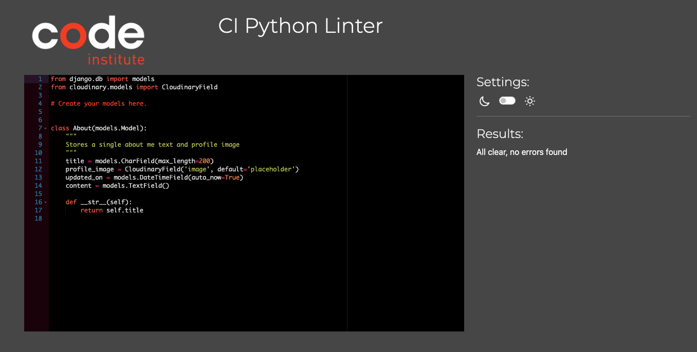

# Testing

Return back to the [README.md](README.md) file.

## Code Validation

### HTML

I have used the recommended [HTML W3C Validator](https://validator.w3.org) to validate all of my HTML files.

| Page | W3C URL | Screenshot | Notes |
| --- | --- | --- | --- |
| Home | [W3C](https://validator.w3.org/nu/?doc=https%3A%2F%2Fpp4-jetset-journal-4cbea9e2528c.herokuapp.com%2F) |  | Element p not allowed as child of element span in this context, but displays fine. A document must not include more than one visible main element. |
| Contact | [W3C](https://validator.w3.org/nu/?doc=https%3A%2F%2Fpp4-jetset-journal-4cbea9e2528c.herokuapp.com%2Fcontact%2F) |  | Element p not allowed as child of element span in this context, but displays fine.|
| About | [W3C](https://validator.w3.org/nu/?doc=https%3A%2F%2Fpp4-jetset-journal-4cbea9e2528c.herokuapp.com%2Fabout%2F) |  | Element p not allowed as child of element span in this context. (Suppressing further errors from this subtree.) Bad value 75% for attribute width on element img. |

### CSS

I have used the recommended [CSS Jigsaw Validator](https://jigsaw.w3.org/css-validator) to validate all of my CSS files.

| File | Jigsaw URL | Screenshot | Notes |
| --- | --- | --- | --- |
| style.css | n/a |  | Pass: No Errors |
| admin.css | n/a |  | Pass: No Errors |

### JavaScript

I have used the recommended [JShint Validator](https://jshint.com) to validate all of my JS files.

| File | Screenshot | Notes |
| --- | --- | --- |
| comments.js |  | 1 undefined variable (bootstrap) from external files |

### Python

I have used the recommended [PEP8 CI Python Linter](https://pep8ci.herokuapp.com) to validate all of my Python files.

| File | Screenshot | Notes |
| --- | --- | --- |
| manage.py |  | Pass: No Errors |
| settings.py |  | E128 continuation line under-indented for visual indent. E124 closing bracket does not match visual indentation. |
| About admin.py |  |  Pass: No Errors |
| About models.py |  | Pass: No Errors |
| About views.py |  | Pass: No Errors |
| Blog admin.py |  | Pass: No Errors |
| Blog models.py |  | Pass: No Errors |
| Blog urls.py |  | Pass: No Errors |
| Blog views.py |  | Pass: No Errors |
| Contact admin.py |  | Pass: No Errors |
 Contact forms.py |  | Pass: No Errors |
| Contact models.py |  | Pass: No Errors |
| Contact urls.py |  | Pass: No Errors|
| Contact views.py |  | E501 line too long (115 > 79 characters).|

## Browser Compatibility

I've tested my deployed project on multiple browsers to check for compatibility issues.

The production site was tested using [Browserstack](https://www.browserstack.com/) to ensure compatibility across various devices, and browsers including Mac, iPhone, Windows and Android, Chrome, Safari and Firefox on different pages chosen at random.

## Responsiveness

I've tested my deployed project on multiple devices to check for responsiveness issues.

| Device | Home | About | Contact | Blog Details | Notes |
| --- | --- | --- | --- | --- | --- |
| Mobile (DevTools) |  |  |  |  | Works as expected |
| Tablet (DevTools) |  |  |  |  | Works as expected |
| Desktop |  |  |  |  | Works as expected |
| XL Monitor |  |  |  |  | Scaling starts to have minor issues |

## Lighthouse Audit

I've tested my deployed project using the Lighthouse Audit tool to check for any major issues.

| Page | Desktop | Notes |
| --- | --- | --- |
| Home |  | Slow response time due to large images |
| About |  | Some minor warnings |
| Contact |  | Some minor warnings |
| Blog Details |  | Medium response time due to large image |

## Defensive Programming

| Page | User Action | Expected Result | Pass/Fail | Comments |
| --- | --- | --- | --- | --- |
| Home | | | | |
| | Click on Logo | Redirection to Home page | Pass | |
| | Click on Home link in navbar | Redirection to Home page | Pass | |
| | Click on About link in navbar | Redirection to About page | Pass | |
| | Click on Contact link in navbar | Redirection to Contact page | Pass | |
| | Click on Login/Register link in navbar | Redirection to Login page | Pass | |
| | Click on Logout link in navbar | Redirection to Logout page | Pass | |
| | Click on Blog Post link (title/exceprt in card) | Redirection to blog detail page for that post | Pass | |
| Contact | | | | |
| | Click on Contact link in navbar | Redirection to Contact page | Pass | |
| | Enter name | Field will accept text / numbers | Pass | |
| | Enter valid email address | Field will only accept email address format | Pass | |
| | Enter message in textarea | Field will accept freeform text | Pass | |
| | Click the Submit button | Redirects user to Contact page (blank form) and displays succes message | Pass | User must click 'Back' button to return |
| Sign Up | | | | |
| | Click on Sign Up button | Redirection to Sign Up page | Pass | |
| | Enter valid email address (optional - can be blank) | Field will only accept email address format | Pass | |
| | Enter valid password (twice) | Field will only accept password format | Pass | |
| | Click on Sign Up button | Redirects user to Home page, with user logged in, and displays succes message | Pass | |
| Log In | | | | |
| | Click on the Login link | Redirection to Login page | Pass | |
| | Enter valid email address | Field will only accept email address format | Pass | |
| | Enter valid password | Field will only accept password format | Pass | |
| | Click Login button | Redirects user to home page | Pass | |
| Log Out | | | | |
| | Click Logout button | Redirects user to logout page | Pass | Confirms logout first |
| | Click Confirm Logout button | Redirects user to home page | Pass | |

## User Story Testing

| User Story | Screenshot |
| --- | --- |
| As a new site user, I would like to view an intuitive website with straightforward navigation that is fully responsive. |  |
| As a new site user, I would like to create an account so that I can comment on and like blog posts. |  |
| As a new site user, I would like to easily edit and delete any comments that I make. |  |
| As a new site user, I would like to easily contact the website administrators with questions. |  |
| As a new site user, I would like to easily understand the main purpose of the site. |  |
| As a new user, I want attractive and relevant visuals and colour schemes that work with the content. | n/a |
| As a returning site user, I would like to view an intuitive website with straightforward navigation that is fully responsive. |  |
| As a returning site user, I would like to easily log into my account so that I can comment on and like blog posts. |  |
| As a returning site user, I would like to easily edit and delete any comments that I make. |  |
| As a site administrator, I would like to have a recognizable branded admininstator area to manage users, blog posts, blogs comments and blog likes. |  |
| As a site administrator, I would like to easily create blog postings in draft or published form, for display on Jetset Journal. |  |
| As a site administrator, I would like to easily edit the about text and profile picture using a user-friendly UI. |  |
| As a site administrator, I would like to have control over approving user comments before they appear on the front-end. |  |
| As a site administrator, I would like to manage user contact requests and mark them as read. |  |
| As a site administrator, I would like to have a simple UI that will encourage users to return and engage with the blog. | n/a |

## Automated Testing

I have conducted a series of automated tests on my application.

I fully acknowledge and understand that, in a real-world scenario, an extensive set of additional tests would be more comprehensive.

### Python (Unit Testing)

🛑🛑🛑🛑🛑 START OF NOTES (to be deleted) 🛑🛑🛑🛑🛑

Adjust the code below (file names, etc.) to match your own project files/folders.

🛑🛑🛑🛑🛑 END OF NOTES (to be deleted) 🛑🛑🛑🛑🛑

I have used Django's built-in unit testing framework to test the application functionality.

In order to run the tests, I ran the following command in the terminal each time:

`python3 manage.py test name-of-app `

To create the coverage report, I would then run the following commands:

`coverage run --source=name-of-app manage.py test`

`coverage report`

To see the HTML version of the reports, and find out whether some pieces of code were missing, I ran the following commands:

`coverage html`

`python3 -m http.server`

Below are the results from the various apps on my application that I've tested:

| App | File | Coverage | Screenshot |
| --- | --- | --- | --- |
| Bag | test_forms.py | 99% |  |
| Bag | test_models.py | 89% |  |
| Bag | test_urls.py | 100% |  |
| Bag | test_views.py | 71% |  |
| Checkout | test_forms.py | 99% |  |
| Checkout | test_models.py | 89% |  |
| Checkout | test_urls.py | 100% |  |
| Checkout | test_views.py | 71% |  |
| Home | test_forms.py | 99% |  |
| Home | test_models.py | 89% |  |
| Home | test_urls.py | 100% |  |
| Home | test_views.py | 71% |  |
| Products | test_forms.py | 99% |  |
| Products | test_models.py | 89% |  |
| Products | test_urls.py | 100% |  |
| Products | test_views.py | 71% |  |
| Profiles | test_forms.py | 99% |  |
| Profiles | test_models.py | 89% |  |
| Profiles | test_urls.py | 100% |  |
| Profiles | test_views.py | 71% |  |
| x | x | x | repeat for all remaining tested apps/files |

#### Unit Test Issues

🛑🛑🛑🛑🛑 START OF NOTES (to be deleted) 🛑🛑🛑🛑🛑

Use this section to list any known issues you ran into while writing your unit tests.
Remember to include screenshots (where possible), and a solution to the issue (if known).

This can be used for both "fixed" and "unresolved" issues.

🛑🛑🛑🛑🛑 END OF NOTES (to be deleted) 🛑🛑🛑🛑🛑

## Bugs

🛑🛑🛑🛑🛑 START OF NOTES (to be deleted) 🛑🛑🛑🛑🛑

This section is primarily used for JavaScript and Python applications,
but feel free to use this section to document any HTML/CSS bugs you might run into.

It's very important to document any bugs you've discovered while developing the project.
Make sure to include any necessary steps you've implemented to fix the bug(s) as well.

**PRO TIP**: screenshots of bugs are extremely helpful, and go a long way!

🛑🛑🛑🛑🛑 END OF NOTES (to be deleted) 🛑🛑🛑🛑🛑

- JS Uncaught ReferenceError: `foobar` is undefined/not defined

    

    - To fix this, I _____________________.

- JS `'let'` or `'const'` or `'template literal syntax'` or `'arrow function syntax (=>)'` is available in ES6 (use `'esversion: 11'`) or Mozilla JS extensions (use moz).

    

    - To fix this, I _____________________.

- Python `'ModuleNotFoundError'` when trying to import module from imported package

    

    - To fix this, I _____________________.

- Django `TemplateDoesNotExist` at /appname/path appname/template_name.html

    

    - To fix this, I _____________________.

- Python `E501 line too long` (93 > 79 characters)

    

    - To fix this, I _____________________.

### GitHub **Issues**

🛑🛑🛑🛑🛑 START OF NOTES (to be deleted) 🛑🛑🛑🛑🛑

An improved way to manage bugs is to use the built-in **Issues** tracker on your GitHub repository.
To access your Issues, click on the "Issues" tab at the top of your repository.
Alternatively, use this link: https://github.com/roc-11/pp4-jetset-journal/issues

If using the Issues tracker for your bug management, you can simplify the documentation process.
Issues allow you to directly paste screenshots into the issue without having to first save the screenshot locally,
then uploading into your project.

You can add labels to your issues (`bug`), assign yourself as the owner, and add comments/updates as you progress with fixing the issue(s).

Once you've sorted the issue, you should then "Close" it.

When showcasing your bug tracking for assessment, you can use the following format:

🛑🛑🛑🛑🛑 END OF NOTES (to be deleted) 🛑🛑🛑🛑🛑

**Fixed Bugs**

All previously closed/fixed bugs can be tracked [here](https://github.com/roc-11/pp4-jetset-journal/issues?q=is%3Aissue+is%3Aclosed).

| Bug | Status |
| --- | --- |
| [JS Uncaught ReferenceError: `foobar` is undefined/not defined](https://github.com/roc-11/pp4-jetset-journal/issues/1) | Closed |
| [Python `'ModuleNotFoundError'` when trying to import module from imported package](https://github.com/roc-11/pp4-jetset-journal/issues/2) | Closed |
| [Django `TemplateDoesNotExist` at /appname/path appname/template_name.html](https://github.com/roc-11/pp4-jetset-journal/issues/3) | Closed |

**Open Issues**

Any remaining open issues can be tracked [here](https://github.com/roc-11/pp4-jetset-journal/issues).

| Bug | Status |
| --- | --- |
| [JS `'let'` or `'const'` or `'template literal syntax'` or `'arrow function syntax (=>)'` is available in ES6 (use `'esversion: 11'`) or Mozilla JS extensions (use moz).](https://github.com/roc-11/pp4-jetset-journal/issues/4) | Open |
| [Python `E501 line too long` (93 > 79 characters)](https://github.com/roc-11/pp4-jetset-journal/issues/5) | Open |

## Unfixed Bugs

🛑🛑🛑🛑🛑 START OF NOTES (to be deleted) 🛑🛑🛑🛑🛑

You will need to mention unfixed bugs and why they were not fixed.
This section should include shortcomings of the frameworks or technologies used.
Although time can be a big variable to consider, paucity of time and difficulty understanding
implementation is not a valid reason to leave bugs unfixed.

If you've identified any unfixed bugs, no matter how small, be sure to list them here.
It's better to be honest and list them, because if it's not documented and an assessor finds the issue,
they need to know whether or not you're aware of them as well, and why you've not corrected/fixed them.

Some examples:

🛑🛑🛑🛑🛑 END OF NOTES (to be deleted) 🛑🛑🛑🛑🛑

- On devices smaller than 375px, the page starts to have `overflow-x` scrolling.

    

    - Attempted fix: I tried to add additional media queries to handle this, but things started becoming too small to read.

- For PP3, when using a helper `clear()` function, any text above the height of the terminal does not clear, and remains when you scroll up.

    

    - Attempted fix: I tried to adjust the terminal size, but it only resizes the actual terminal, not the allowable area for text.

- When validating HTML with a semantic `section` element, the validator warns about lacking a header `h2-h6`. This is acceptable.

    

    - Attempted fix: this is a known warning and acceptable, and my section doesn't require a header since it's dynamically added via JS.

🛑🛑🛑🛑🛑 START OF NOTES (to be deleted) 🛑🛑🛑🛑🛑

If you legitimately cannot find any unfixed bugs or warnings, then use the following sentence:

🛑🛑🛑🛑🛑 END OF NOTES (to be deleted) 🛑🛑🛑🛑🛑

There are no remaining bugs that I am aware of.
