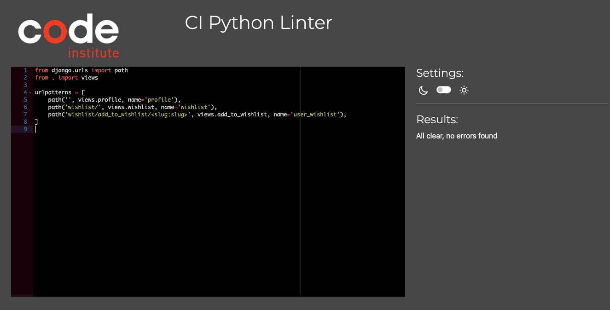
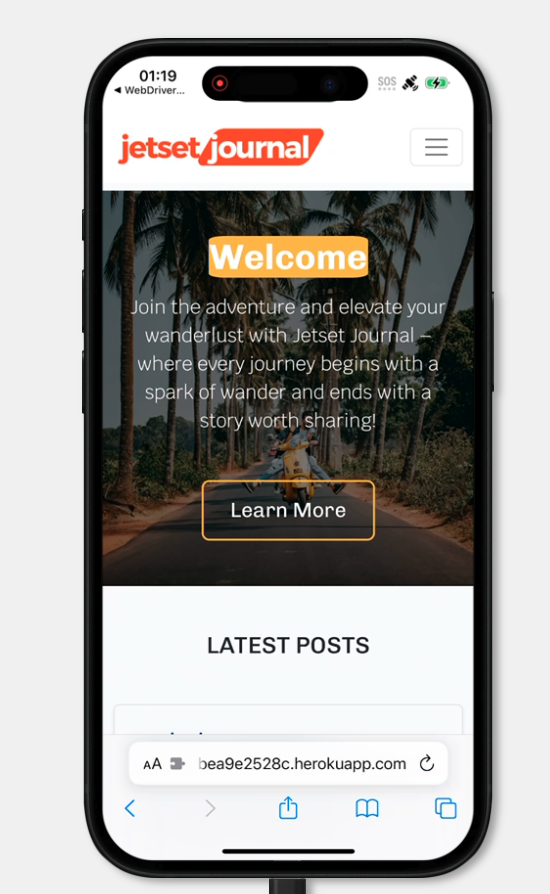
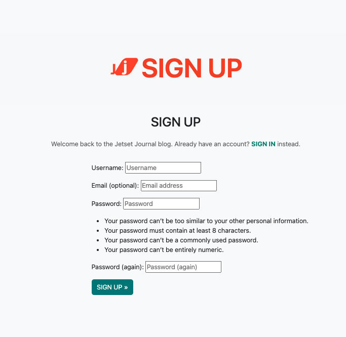

# Testing

Return back to the [README.md](README.md) file.

## Code Validation

### HTML

I have used the recommended [HTML W3C Validator](https://validator.w3.org) to validate all of my HTML files.

| Page | W3C URL | Screenshot | Notes |
| --- | --- | --- | --- |
| Home | [W3C](https://validator.w3.org/nu/?doc=https%3A%2F%2Fpp4-jetset-journal-4cbea9e2528c.herokuapp.com%2F) |  | no errors |
| Contact | [W3C](https://validator.w3.org/nu/?doc=https%3A%2F%2Fpp4-jetset-journal-4cbea9e2528c.herokuapp.com%2Fcontact%2F) |  | no errors |
| About | [W3C](https://validator.w3.org/nu/?doc=https%3A%2F%2Fpp4-jetset-journal-4cbea9e2528c.herokuapp.com%2Fabout%2F) |  | Bad value 75% for attribute width on element img. Displays as expected. |
| Profile | [W3C](https://validator.w3.org/nu/?doc=https%3A%2F%2Fpp4-jetset-journal-4cbea9e2528c.herokuapp.com%2Fprofile%2F) |  | no errors |

### CSS

I have used the recommended [CSS Jigsaw Validator](https://jigsaw.w3.org/css-validator) to validate all of my CSS files.

| File | Jigsaw URL | Screenshot | Notes |
| --- | --- | --- | --- |
| style.css | n/a |  | Pass: No Errors |
| admin.css | n/a |  | Pass: No Errors |

### JavaScript

I have used the recommended [JShint Validator](https://jshint.com) to validate all of my JS files.

| File | Screenshot | Notes |
| --- | --- | --- |
| comments.js |  | 1 undefined variable (bootstrap) from external files |

### Python

I have used the recommended [PEP8 CI Python Linter](https://pep8ci.herokuapp.com) to validate all of my Python files.

| File | Screenshot | Notes |
| --- | --- | --- |
| manage.py |  | Pass: No Errors |
| settings.py |  | Pass: No Errors |
| About admin.py |  |  Pass: No Errors |
| About models.py |  | Pass: No Errors |
| About views.py |  | Pass: No Errors |
| Blog admin.py |  | Pass: No Errors |
| Blog models.py |  | Pass: No Errors |
| Blog urls.py |  | Pass: No Errors |
| Blog views.py |  | Pass: No Errors |
| Contact admin.py |  | Pass: No Errors |
| Contact forms.py |  | Pass: No Errors |
| Contact models.py |  | Pass: No Errors |
| Contact urls.py |  | Pass: No Errors|
| Contact views.py |  | E501 line too long (115 > 79 characters). noqa |
| Profiles admin.py |  | Pass: No Errors |
| Profiles forms.py |  | Pass: No Errors |
| Profiles models.py |  | Pass: No Errors |
| Profiles urls.py |  | Pass: No Errors|
| Profiles views.py |  | E501 line too long (115 > 79 characters). noqa |

## Browser Compatibility

I've tested my deployed project on multiple browsers to check for compatibility issues.

The production site was tested using [Browserstack](https://www.browserstack.com/) to ensure compatibility across various devices, and browsers including Mac, iPhone, Windows and Android, Chrome, Safari and Firefox on different pages chosen at random.





## Responsiveness

I've tested my deployed project on multiple devices to check for responsiveness issues.

| Device | Home | About | Contact | Blog Details | Notes |
| --- | --- | --- | --- | --- | --- |
| Mobile (DevTools) |  |  |  |  | Works as expected |
| Tablet (DevTools) |  |  |  |  | Works as expected |
| Desktop |  |  |  |  | Works as expected |
| XL Monitor |  |  |  |  | Scaling starts to have minor issues |

## Lighthouse Audit

I've tested my deployed project using the Lighthouse Audit tool to check for any major issues.

| Page | Desktop | Notes |
| --- | --- | --- |
| Home |  | Slow response time due to large images |
| About |  | Some minor warnings |
| Contact |  | Some minor warnings |
| Blog Details |  | Medium response time due to large image |

## Defensive Programming

| Page | User Action | Expected Result | Pass/Fail | Comments |
| --- | --- | --- | --- | --- |
| Home | | | | |
| | Click on Logo | Redirection to Home page | Pass | |
| | Click on Home link in navbar | Redirection to Home page | Pass | |
| | Click on About link in navbar | Redirection to About page | Pass | |
| | Click on Contact link in navbar | Redirection to Contact page | Pass | |
| | Click on Login/Register link in navbar | Redirection to Login page | Pass | |
| | Click on Logout link in navbar | Redirection to Logout page | Pass | |
| | Click on Blog Post link (title/exceprt in card) | Redirection to blog detail page for that post | Pass | |
| Contact | | | | |
| | Click on Contact link in navbar | Redirection to Contact page | Pass | |
| | Enter name | Field will accept text / numbers | Pass | |
| | Enter valid email address | Field will only accept email address format | Pass | |
| | Enter message in textarea | Field will accept freeform text | Pass | |
| | Click the Submit button | Redirects user to Contact page (blank form) and displays succes message | Pass | User must click 'Back' button to return |
| Sign Up | | | | |
| | Click on Sign Up button | Redirection to Sign Up page | Pass | |
| | Enter valid email address (optional - can be blank) | Field will only accept email address format | Pass | |
| | Enter valid password (twice) | Field will only accept password format | Pass | |
| | Click on Sign Up button | Redirects user to Home page, with user logged in, and displays succes message | Pass | |
| Log In | | | | |
| | Click on the Login link | Redirection to Login page | Pass | |
| | Enter valid email address | Field will only accept email address format | Pass | |
| | Enter valid password | Field will only accept password format | Pass | |
| | Click Login button | Redirects user to home page | Pass | |
| Log Out | | | | |
| | Click Logout button | Redirects user to logout page | Pass | Confirms logout first |
| | Click Confirm Logout button | Redirects user to home page | Pass | |

## User Story Testing

| User Story | Screenshot |
| --- | --- |
| As a new site user, I would like to view an intuitive website with straightforward navigation that is fully responsive. |  |
| As a new site user, I would like to create an account so that I can comment on and like blog posts. |  |
| As a new site user, I would like to easily edit and delete any comments that I make. |  |
| As a new site user, I would like to easily contact the website administrators with questions. |  |
| As a new site user, I would like to easily understand the main purpose of the site. |  |
| As a new user, I want attractive and relevant visuals and colour schemes that work with the content. | n/a |
| As a new site user, I would like to add blog posts to my wishlist/favourites so that I can return to them at a later date/time. |  |
| As a returning site user, I would like to view an intuitive website with straightforward navigation that is fully responsive. |  |
| As a returning site user, I would like to easily log into my account so that I can comment on and like blog posts. |  |
| As a returning site user, I would like to easily edit and delete any comments that I make. |  |
| As a returning site user, I would like to add blog posts to my wishlist/favourites so that I can return to them at a later date/time. |  |
| As a site administrator, I would like to have a recognizable branded admininstator area to manage users, blog posts, blogs comments and blog likes. |  |
| As a site administrator, I would like to easily create blog postings in draft or published form, for display on Jetset Journal. |  |
| As a site administrator, I would like to easily edit the about text and profile picture using a user-friendly UI. |  |
| As a site administrator, I would like to have control over approving user comments before they appear on the front-end. |  |
| As a site administrator, I would like to manage user contact requests and mark them as read. |  |
| As a site administrator, I would like to have a simple UI that will encourage users to return and engage with the blog. | n/a |
| As a site administrator, I would like to easily add a new blog post to the website/blog from the front-end/website. |  |
| As a site administrator, I would like to easily edit or delete a blog post from the  website/blog from the front-end/website. |  |

## Automated Testing

I have conducted a series of automated tests on my application.

I fully acknowledge and understand that, in a real-world scenario, an extensive set of additional tests would be more comprehensive.

### Python (Unit Testing)

I tried used Django's built-in unit testing framework to test the application functionality.

In order to run the tests, I ran the following command in the terminal each time:

`python3 manage.py test name-of-app `

To create the coverage report, I would then run the following commands:

`coverage run --source=name-of-app manage.py test`

`coverage report`

To see the HTML version of the reports, and find out whether some pieces of code were missing, I ran the following commands:

`coverage html`

`python3 -m http.server`

#### Unit Test Issues

My tests do not work correctly. I ran into an issue. The bug lies somewhere in my blog/models.py file. It is a field error somewhere in a model. 

I looked at each field on all the models, and check that each one is syntactically correct, and does not contain any thing which would allow the model to insert an empty field. However I could not identify exactly where the issue arose. Looking online is seems that it likely is an issue with your models, somewhere, it could be something as simple as not specifying a max-length on a CharField, or one of the fields being null. 

`python3 manage.py test blog`

Results in the following error: 

```
Found 4 test(s).
Creating test database for alias 'default'...
Traceback (most recent call last):
File "/workspace/.pip-modules/lib/python3.9/site-packages/django/db/backends/utils.py", line 87, in _execute
return self.cursor.execute(sql)
File "/workspace/.pip-modules/lib/python3.9/site-packages/django/db/backends/sqlite3/base.py", line 324, in execute
return super().execute(query)
sqlite3.OperationalError: near "None": syntax error
```

## Unfixed Bugs

- Users are able to enter numbers as a username on registration. It results in an error but the user is still added to the User Table. I will need to fix this in future iterations of the Jetset Journal Project.

There are no remaining bugs that I am aware of.
